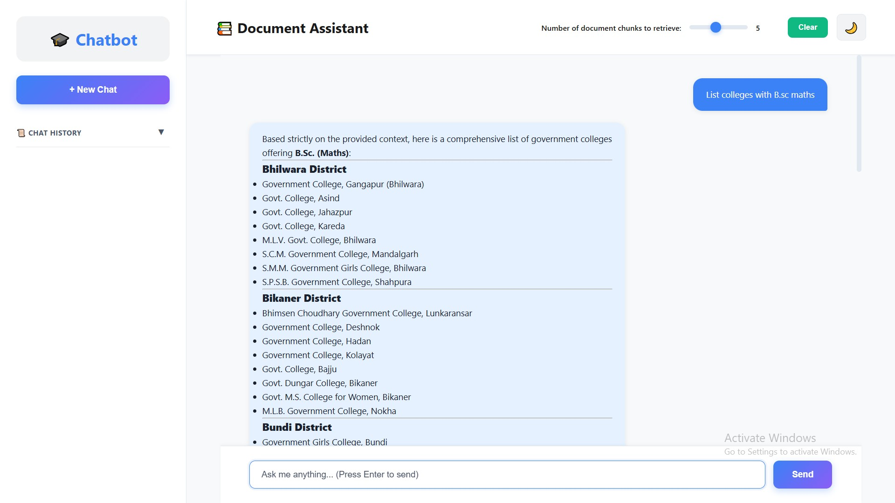

# Agentic-Rag-Student-Career-Guidance 🤖🎓

Welcome to **Agentic-Rag-Student-Career-Guidance**: an AI-powered platform designed to help students navigate their study journey and career path. Combining state-of-the-art Retrieval-Augmented Generation (RAG), document processing, and a modern frontend, this project delivers personalized guidance and answers to student questions.

---

## Output


## 🚀 Introduction

**Agentic-Rag-Student-Career-Guidance** leverages advanced AI (Azure OpenAI) and robust retrieval mechanisms (FAISS) to deliver intelligent, context-aware responses to student queries. Upload documents (PDF/TXT/MD), chat with the bot, and get tailored guidance for your academic and career choices—all through a sleek, responsive interface.

---

## ✨ Features

- **Document Processing**: Load, clean, and chunk PDFs, TXT, and Markdown files for knowledge ingestion.
- **Retrieval-Augmented Generation (RAG)**: Embeddings and FAISS-based retrieval for relevant context.
- **Azure OpenAI Integration**: High-quality answer generation using LLMs.
- **Modern Frontend**: Responsive UI built with Next.js, Tailwind CSS, and Gradio; optimized for all devices.
- **Multi-Document Support**: Auto-load documents from a directory for seamless knowledge updates.
- **Customizable Themes**: Light/dark mode toggle and stylish visuals.
- **Student-Focused Chatbot**: Instant answers to educational and career questions.

---

## 🛠️ Installation

### Backend Setup

1. **Clone the repository**
   ```bash
   git clone https://github.com/your-org/Agentic-Rag-Student-Career-Guidance.git
   cd Agentic-Rag-Student-Career-Guidance
   ```

2. **Create a virtual environment and install dependencies**
   ```bash
   python3 -m venv venv
   source venv/bin/activate
   pip install -r backend/requirements.txt
   ```

3. **Set up environment variables**
   - Create a `.env` file in `backend/` with your Azure OpenAI credentials.

### Frontend Setup

1. **Navigate to frontend directory**
   ```bash
   cd frontend
   ```

2. **Install Node.js dependencies**
   ```bash
   npm install
   ```

3. **Start the frontend**
   ```bash
   npm run dev
   ```

---

## 📚 Usage

1. **Add your study documents**
   - Place PDF, TXT, or MD files into the `data/` directory.

2. **Start the backend server**
   - Run your Gradio app:
     ```bash
     python backend/app.py
     ```
   - Or run the Next.js frontend:
     ```bash
     npm run dev
     ```

3. **Interact with the chatbot**
   - Visit the local URL shown in your terminal.
   - Upload or select documents, ask questions, and get instant, context-rich answers.

---

## 🤝 Contributing

We welcome contributions! To get started:

1. Fork the repository.
2. Create a new branch (`git checkout -b feature/your-feature`).
3. Commit your changes and push (`git push origin feature/your-feature`).
4. Open a Pull Request and describe your changes.

Please check [CONTRIBUTING.md](CONTRIBUTING.md) for guidelines.

---

## 📄 License

This project is licensed under the [MIT License](LICENSE).  
Feel free to use, modify, and share—just keep the credits!

---

## 🗂️ Project Structure

```
Agentic-Rag-Student-Career-Guidance/
│
├── backend/
│   ├── llm.py          # Azure OpenAI answer generation
│   ├── processing.py   # Document loading & chunking
│   ├── rag.py          # Embeddings & FAISS retrieval
│   └── app.py          # Gradio app server
│
├── frontend/
│   ├── app/            # Next.js app, global styles, layouts
│   ├── components/     # Chat input, chat interface, UI components
│   ├── components.json # UI config
│   └── README.md       # Frontend-specific docs
│
└── data/               # Uploaded study documents
```


## 💡 Get In Touch

Questions, suggestions, or feedback?  
Open an issue or reach out via [GitHub Discussions](https://github.com/your-org/Agentic-Rag-Student-Career-Guidance/discussions)!


**Empowering students with intelligent guidance.**  
**Start your learning journey today!** 🚀

## License
This project is licensed under the **MIT** License.


🔗 GitHub Repo: https://github.com/Tharanika-R-Git/Agentic-Rag-Student-Career-Guidance
